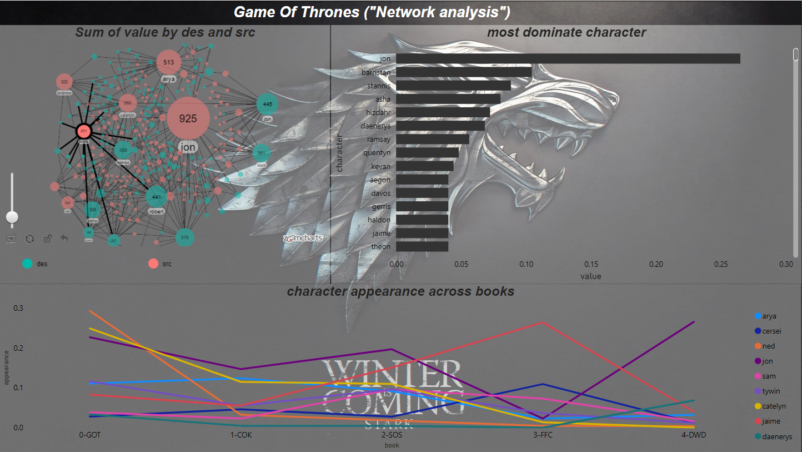
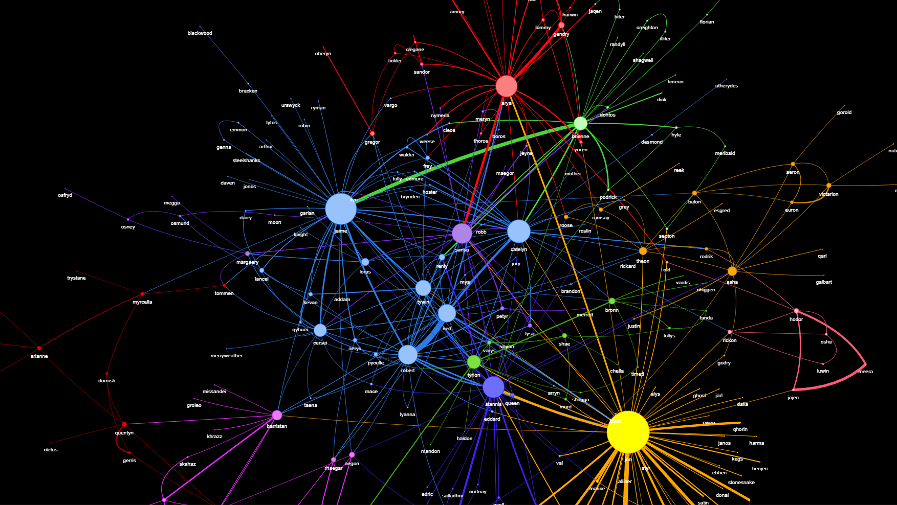

# Game of Thrones (network analysis)

## technologies
python, pandas, spacy, pyvis, BeautifulSoup,lxml,fitz

### working plan
- the main data collected from [book pdf](https://www.keithmitchellphotography.com/complete-a-song-of-ice-and-fire---george-r-r-martin.pdf) using fitz to read page by page 
- scrape got Wiki to get the character's name 
- pass the collected data after doing some manipulation on text to spacy to split it into sentences and extract the entities
- compare extracted entities with real character names 
- every two following names will build a relationship for them and create pandas dataframe to save relations 
- group relation and calculate a value for each one 
- pass relation to pyvis to draw network and use it in some analysis 

#### snap from the result of pyvis
